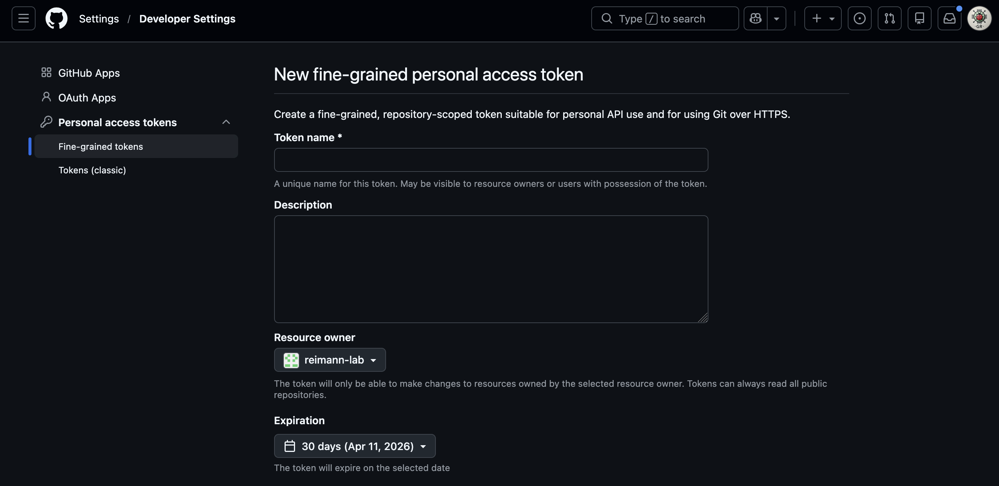
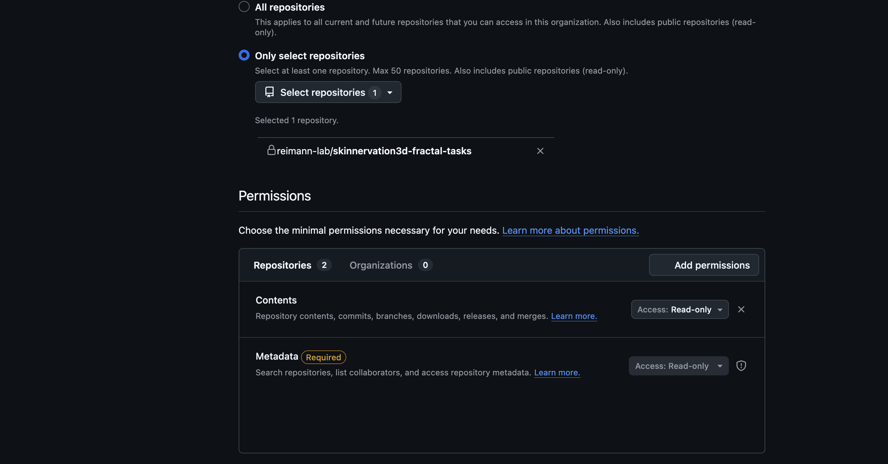

# Installation Guide

## What you need before starting

| Requirement | Notes |
|---|---|
| **Internet connection** | To download Miniforge, conda packages, and source code |
| **Git** | the installer will tell you if it's missing (see [Troubleshooting - Git Installation](#git-installation)) for more info on how to install Git |
| **GitHub PAT** | Personal Access Token for the private repositories (see section [Personal Access Token](#github-personal-access-token)) |
| **~5 GB free disk space** | For Miniforge, two conda environments, and source code |

---

## GitHub Personal Access Token

To be able to download the private repositories that are part of the software dependencies, you need a GitHub Personal Access Token (PAT). To generate one, you need to have the access rights to the private repositories. If that's the case, follow these steps to generate a PAT that you can use for yourself to install the app or share with trusted users:

1. Go to <https://github.com/settings/tokens>
2. Click **"Generate new token" (fine-grained, repo-scoped)** (!! not the classic option)
3. You can now give it a name to identify it (e.g. `SkInnervation3D install`) and set the ownership to yourself or the organisation the repositories belong to. You can also set an expiration date.

{ width="40%" }

4. Under *Repository access*, select all the private repositories you want to grant access to (here `skinnervation-fractal-tasks`). Finally, give it the *contents* permission, so that it can clone the repositories locally.

{ width="40%" }


5. Click **"Generate token"** and copy it safely. ⚠ The token is shown only once. Keep it somewhere safe until the install is done.
6. During installation, you will be asked to enter the token. You can copy paste it when prompted. It won't appear as typed in, that is normal, just press enter after copy-pasting it.

---

## Installation steps per OS

### macOS / Linux

1. Download **`install.sh`** and **`install.py`** from the [GitHub repository](https://github.com/reimann-lab/skinnervation3d-app) and save them into the same folder
2. On Linux or macOS, open a terminal in that folder and run:
   ```bash
   bash install.sh
   ```
3. On macOS you can double-click `install.sh` in Finder (right-click → Open).

### Windows

1. Download **`install.bat`** and **`install.py`** from the [GitHub repository](https://github.com/reimann-lab/skinnervation3d-app) and save them into the same folder
2. Double-click **`install.bat`**
   - If Windows shows a security warning, click **"Run anyway"**
   - If you get a permission error, right-click → **"Run as administrator"**


### What the installer does

1. **Checks for Git** — exits with an error if not found
2. **Installs Miniforge** — if conda is not already on your system, Miniforge is downloaded and installed silently into `~/miniforge3`
3. **Asks you three questions:**
   - Where to install the app files (default: `~/SkInnervation3D`)
   - Where your imaging data lives (used to pre-populate the file browser)
   - Your GitHub PAT (typed invisibly, used only for cloning — never stored)
4. **Clones all repositories** into `<install_dir>/repos/`
5. **Creates two conda environments:**
   - `napari-crop` — for the napari plugin
   - `skin3d-app` — for the UI app and analysis packages
6. **Writes a config file** at `<install_dir>/skinnervation3d-app/src/skinnervation3d_app/config.py`
7. **Creates a desktop shortcut** — double-click to launch the app

---


## Updating

To update the application and all necessary packages to the latest version, re-run the installer. It will update
(`git pull`) each package instead instead of re-cloning, and skip environment creation if
the environments already exist.

### For technical users

If you want to force a full reinstall of a specific conda environment, you can simply remove it:
```bash
conda env remove -n skin3d-app
conda env remove -n napari-crop
```
Then re-run the installer.

---

## Troubleshooting

### Summary

| Problem | Solution |
|---|---|
| `git: command not found` | Install Git from [git-scm.com](https://git-scm.com). See [Troubleshooting - Git Installation](#git-installation) for more infos |
| `Authentication failed` cloning repos | Check your PAT has `contents` permissions for all private repositories and hasn't expired |
| App shortcut doesn't open | Open a terminal (macOS or Linus) or the miniforge prompt (Windows), run `conda activate skin3d-app` then `skin3d-app`. For windows, if this still fails, type `python -m skinnervation3d_app` instead of `skin3d-app` |
| Windows: PowerShell execution policy error | Run `Set-ExecutionPolicy RemoteSigned -Scope CurrentUser` in PowerShell, then re-run `install.bat` |
| Conda env creation fails | Delete the partial env with `conda env remove -n skin3d-app` in a terminal (macOS or Linus) or the miniforge prompt (Windows) and re-run the installer |

---

### Git Installation

1. Download the latest installer from [git-scm.com](https://git-scm.com)
2. Run it and click **Next** through most screens. The only options that matter are:

    - **Override the default branch name for new repositories** instead of **Let Git decide**

    - **Adjusting your PATH environment** → select **Git from the command line and also from 3rd-party software** (this is the default — just don't change it)


3. Everything else can stay at its default. Click through and finish.
4. To verify it worked: open a new Terminal or Command Prompt on Windows and type git --version — you should see a version number.