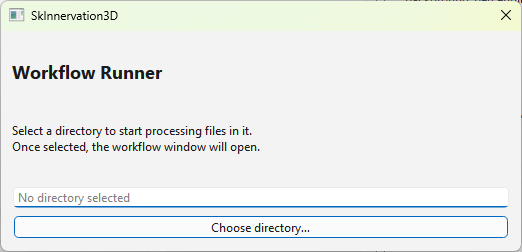
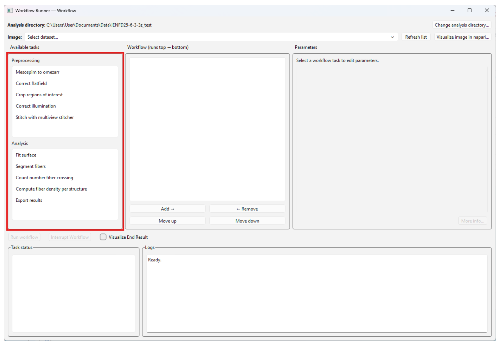
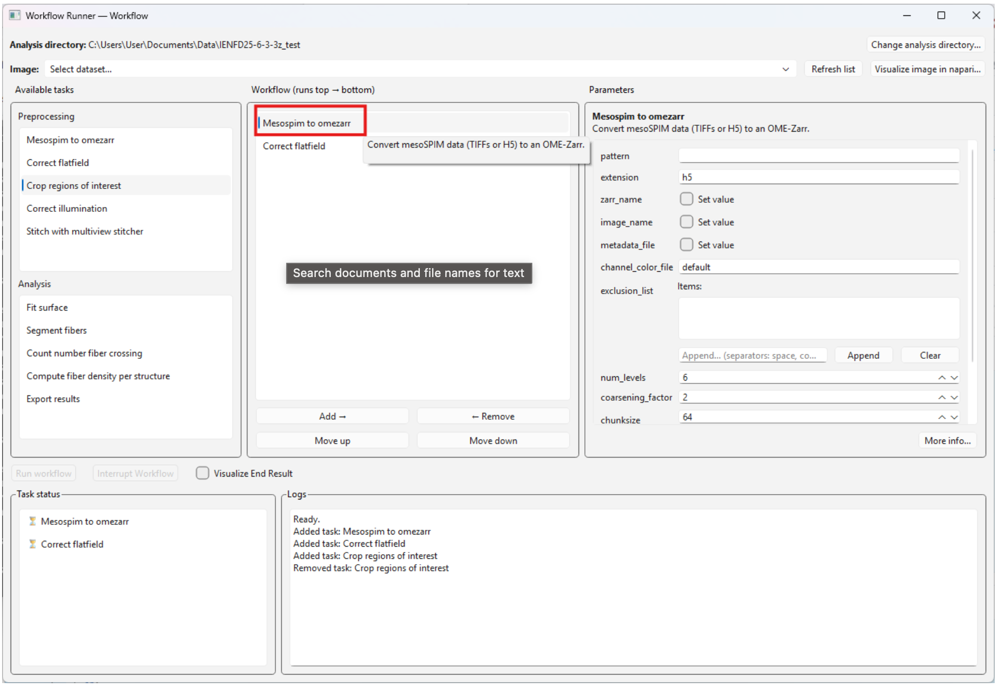
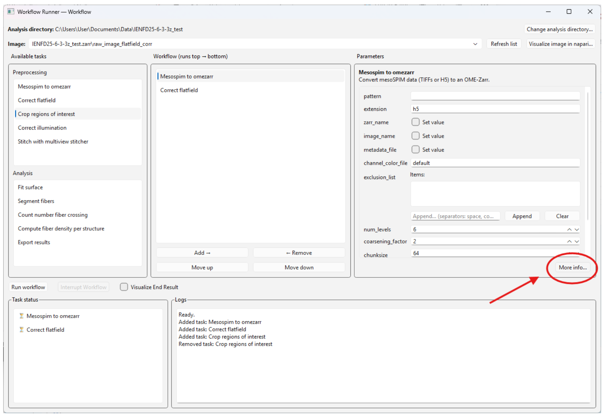
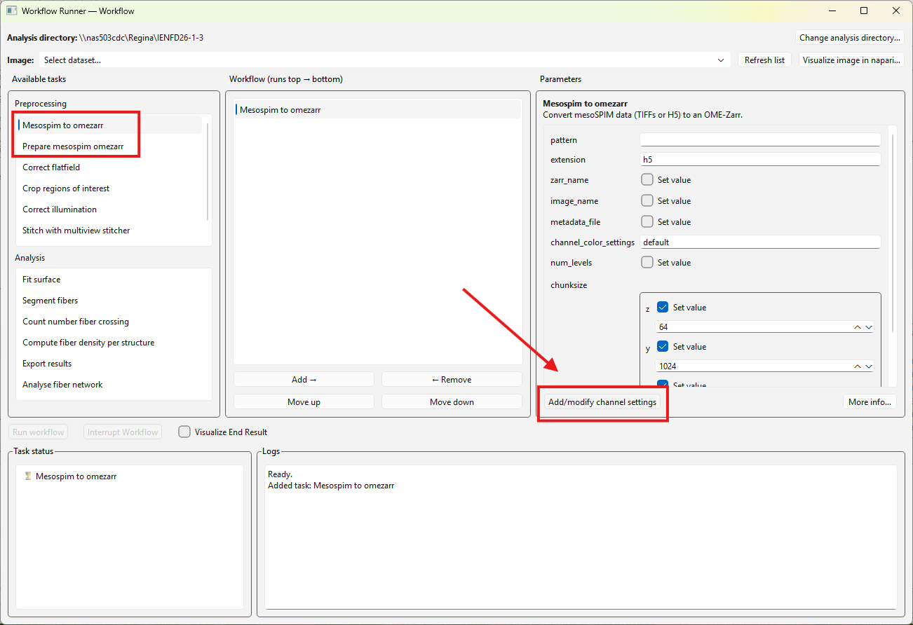
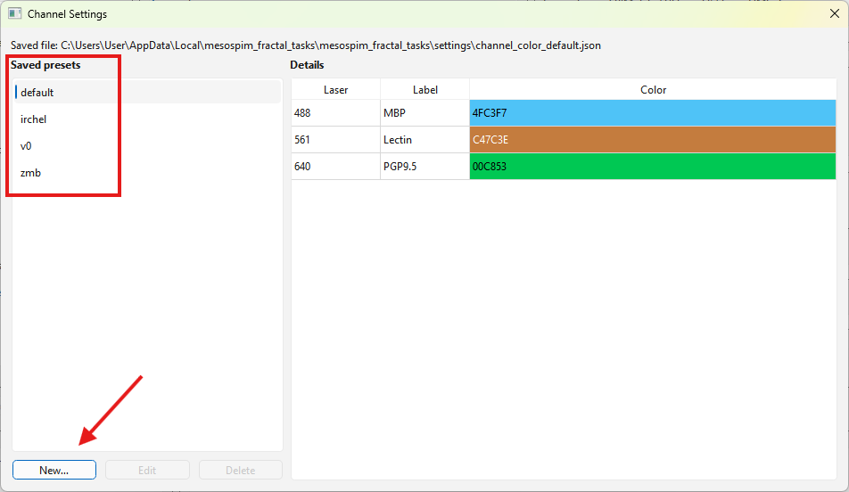
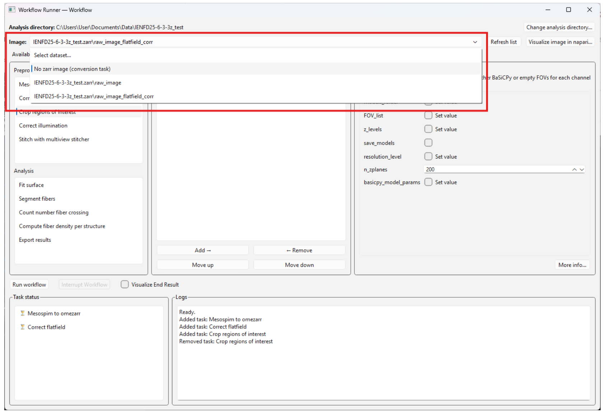
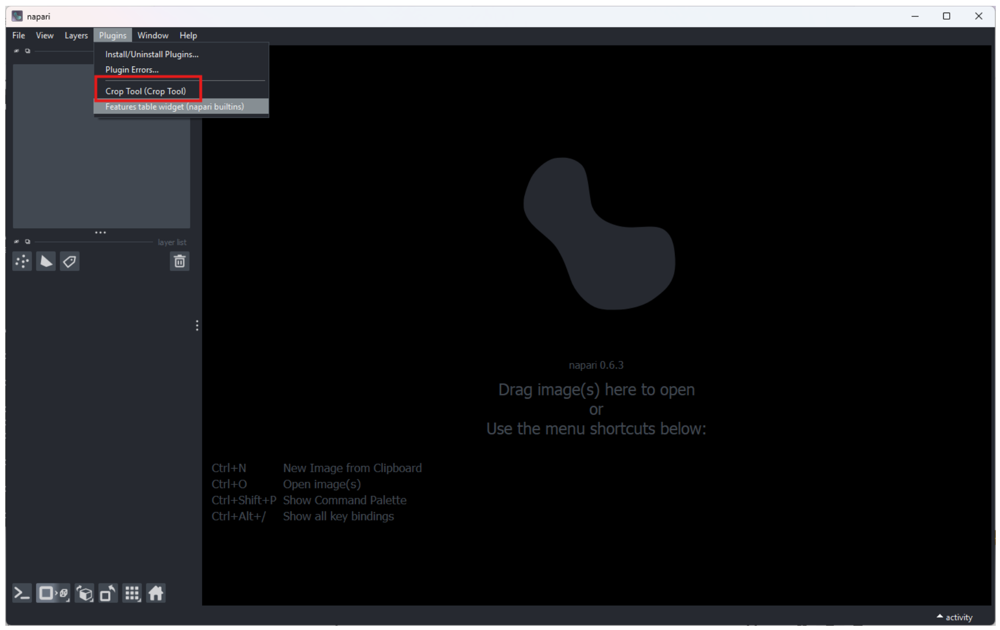

# Usage

## Getting Started

To start using the SkInnervation3D User Interface, you need to select the directory that contains the files you want to process. This is done in the opening window once you launch the application.



Once the analysis directory is set, it will only process and output files in this directory. It will also output the logs about the workflow you have launched in this directory.

---

## Creating a Workflow

You can create a workflow by selecting tasks in the left panel to add them to the workflow list. Tasks will be processed **from top to bottom** — each task in the workflow list will use the output image of the previous task and so on.



A typical workflow is composed of two separate parts:

### Pre-processing

This part is about preparing the raw image so it can be analysed. The steps are usually performed in the following order:

1. **Mesospim to OmeZarr** or **Prepare mesoSPIM OME-Zarr**
2. **Flat-field Correction**
3. **Full Sample Cropping** (Crop Regions of Interest)
    - This requires defining a crop region **before** running the task using the napari crop plugin
4. **Illumination Correction**
5. **Stitching**

Additionally, you can also use **Modify OME-Zarr Structure** to modify the structure of an existing OME-Zarr, such as the size of the multi-resolution pyramid or the channel names/colors. 

Finally, once you are done analysing an image, you can archive it by using **Archive or Dearchive OME-Zarr**. This will compress the images by 2-3x in the OME-Zarr and output a unique TAR file containing the archived OME-Zarr.


### Analysis

This part concerns all the analyses that can be performed on the regions of interest — for example, those taken at the DEJ or a muscle/gland. The steps can vary depending on the type of ROI.

**DEJ ROI:**
```
Fit Surface → Segment Fibers → Count Fiber Crossings → Analyse Plexus → Export Results
```

**Muscle/Gland ROI:**
```
Segment Fibers → Compute Fiber Density → Analyse Plexus → Export Results
```

---

## Editing Task Parameters

By clicking on a given task in the workflow list, you can edit its parameters in the right panel. Hovering over a parameter with the mouse will display a short description.



For more details on important parameters, click the **More info...** button. This will open the documentation in your browser — you can still navigate to other tabs while using the app.

> **Note:** Once the application is closed, the documentation will no longer be available.



---

## Channel settings

The channel settings are used to define the channel names and colors in the OME-Zarr. There are already some default settings saved in the application. You can view the existing settings by clicking on the **Add/modify channel settings** button when you are using the task **mesoSPIM to OmeZarr** or **Prepare mesoSPIM OME-Zarr**.



In the channel settings window, you can view the existing channel settings. To use a given channel setting, you need to provide its name in the corresponding parameter of the task. You can also add a new channel setting by clicking on the **New** button if no current channel settings match your needs.



---

## Workflow Execution

Once you have created a workflow, you can run it by clicking on the **Run workflow** button.

---

## Image List

Before running the workflow, you need to select the image in the OME-Zarr that should be processed. If you are running the conversion task, select the **No OME-Zarr image** option.



---

## Visualisation in napari

You can visualise images directly in napari. This launches a napari instance with the **Cropping Tool** pre-installed.

To launch the Cropping Tool:

1. Open the **Plugins** tab in napari
2. Select **Crop Tool** from the menu


